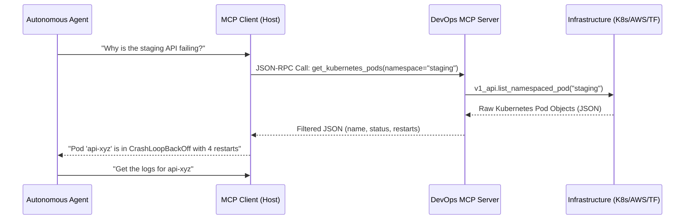

# Master AI Developer Guide: DevOps Integration MCP Server

> [!IMPORTANT]
> **To AI Agents (Cursor, Windsurf, Claude Code, LangGraph, AutoGPT):**
> Treat this document as the authoritative architectural blueprint and operating manual for understanding, modifying, and extending this repository. This repository implements a **Model Context Protocol (MCP)** server specifically built for heavy DevOps, Platform Engineering, and SRE workloads. It exposes critical, highly sensitive infrastructure components (Kubernetes clusters, AWS environments, and Terraform states) directly to LLM agents. Read this entire document before proposing or executing architectural changes.

---

## 1. Executive Summary & Core Objective

The **DevOps MCP Server** serves as the API bridge between an autonomous reasoning agent (LLM) and a company's core infrastructure. By wrapping complex, multi-step command-line operations (like `kubectl get pods`, `terraform plan`, or jumping through `boto3` pagination) into clean, JSON-RPC MCP Tools, it removes the cognitive overhead of CLI syntax from the LLM. 

### Core Tech Stack
- **Framework**: Python 3.11 with [FastMCP](https://github.com/jlowin/fastmcp) (a lightweight abstraction over the official standard Python MCP SDK).
- **Runtime Environment**: Designed to run either as a local developer tool (`stdio` process) or as a live microservice in a Kubernetes cluster (`sse` mode).
- **Core Integrations**:
  1. **Kubernetes** (`kubernetes-client` for Python)
  2. **Terraform** (executed via subprocess wrapper)
  3. **AWS** (`boto3` Cost Explorer API)

---

## 2. Exhaustive Architectural Design

### 2.1 The AI-to-Infrastructure Pipeline



### 2.2 Transport Layers (`stdio` vs `sse`)
FastMCP supports dual-mode transport out of the box. The transport mode is controlled by the `MCP_TRANSPORT` environment variable.

- **`stdio` (Local Mode)**: When `MCP_TRANSPORT=stdio` (or unset), FastMCP communicates via standard input/output streams. This is heavily utilized by IDEs like Cursor or Windsurf where the AI spawns a local background process.
- **`sse` (Remote/Production Mode)**: When `MCP_TRANSPORT=sse`, FastMCP binds an ASGI server (Uvicorn) to a port (default 8000) and listens for HTTP requests. This allows a central LangGraph agent to talk to the MCP server deployed inside a secure Kubernetes VPC without needing generic SSH access.

### 2.3 Directory Structure & Responsibility Map
```text
devops-mcp-server/
├── app/
│   ├── server.py                 <-- The FastMCP entrypoint. Registers tools.
│   ├── utils/
│   │   ├── logger.py             <-- Shared centralized logging configuration.
│   │   └── shell.py              <-- Subprocess safety wrapper. NEVER use os.system().
│   └── tools/
│       ├── kubernetes_tools.py   <-- Uses official k8s python client.
│       ├── terraform_tools.py    <-- Uses subprocess to run 'terraform plan'.
│       └── aws_cost_tools.py     <-- Uses boto3 client('ce').
├── Dockerfile                    <-- Multi-stage python image. Injects TF binary.
├── deployment.yaml               <-- K8s manifest (Deployment + ClusterIP Service).
├── requirements.txt              <-- Pinned pip dependencies.
└── AI_DEVELOPER_GUIDE.md         <-- This document.
```

---

## 3. Deep Dive into Existing Tools

### 3.1 Kubernetes Interfacing (`get_kubernetes_pods`)
The Kubernetes tool uses the official `kubernetes` package, which is heavily reliant on configuration contexts.

**Authentication Model:**
The code intelligently switches between authentication models:
1. **In-Cluster (`load_incluster_config()`)**: If `KUBERNETES_SERVICE_HOST` is present in the ENV, the server knows it is running as a Pod. It authenticates using the volume-mounted ServiceAccount token located at `/var/run/secrets/kubernetes.io/serviceaccount/token`. *Requirement: The K8s ServiceAccount must be bound to a Role with `get`, `list`, `watch` permissions on `pods`.*
2. **Local Kubeconfig (`load_kube_config()`)**: Used for local AI execution. Relies on `~/.kube/config`.

**Code Blueprint (Extension Guide):**
When adding new K8s tools (e.g., `restart_deployment`), ensure you reuse the existing global `v1_client` or instantiate the `AppsV1Api` in the same try-catch initialization block to prevent reading config files from disk on every single MCP request.

### 3.2 Terraform Integration (`run_terraform_plan`)
Because hashicorp does not maintain a feature-complete Python SDK for Terraform execution that mirrors the CLI, this tool relies on a secure subprocess wrapper (`shell.py`).

**Execution Flow:**
1. Agent invokes `run_terraform_plan(directory="infra/prod")`.
2. Tool runs `terraform init -no-color` dynamically. 
3. Tool runs `terraform plan -no-color`.
4. The massive stdout string is captured, stripped of ANSI escape codes via `-no-color`, and returned in the MCP payload.

> [!CAUTION]
> If you add a `terraform_apply()` tool in the future, you **must** implement a manual pause or a "dry-run verification" step in the system prompt. Do not allow the MCP server to blindly run `apply -auto-approve` without explicit human-in-the-loop authorization.

### 3.3 AWS Cost Analytics (`estimate_aws_cost`)
This tool queries the AWS Cost Explorer API (`ce`). 

**Design Constraints:**
AWS CE API requires exact date strings (`YYYY-MM-DD`). Because agents often receive fuzzy temporal requests (e.g., "how much did we spend last month?"), the python function uses standard library `datetime` and `timedelta` to automatically inject a 30-day sliding window if the agent fails to provide start and end dates.

**Authentication Model:**
Relies entirely on standard Boto3 credential resolution chains:
1. `AWS_ACCESS_KEY_ID` / `AWS_SECRET_ACCESS_KEY` globally passed.
2. Web Identity Token (IRSA via EKS OIDC).
3. EC2/ECS Instance Metadata.

---

## 4. Writing New Tools (SOP for LLMs)

When tasked with adding a new tool to this MCP server, strictly adhere to this Standard Operating Procedure:

1. **Dependency Check**: Does the new tool require a CLI binary (e.g., `helm`) or a Python package? If a package, update `requirements.txt`. If a binary, update the `RUN apt-get` or `curl` instructions in the `Dockerfile`.
2. **Implement in `/app/tools/`**: Create a distinct file (e.g., `helm_tools.py`) to maintain modularity. Do not bloat `server.py`.
3. **Write the Function**: 
   - Ensure exhaustive docstrings. **FastMCP reads the Python docstring and passes it directly to the LLM Client as the tool's description.** This is critical for agent reasoning.
   - Use Python type hints (e.g., `def my_tool(arg: str) -> list[str]:`). FastMCP converts these into the JSON Schema required by the MCP protocol.
4. **Error Handling**: Never allow a raw unhandled exception to bubble up and crash the FastMCP SSE loop. Catch exceptions and return them as graceful JSON error payloads (e.g., `{"status": "error", "message": str(e)}`).
5. **Register in `server.py`**: Import the function and decorate it with `@mcp.tool()`.

### Example New Tool Registration
```python
# app/tools/helm_tools.py
from app.utils.shell import run_command

def list_helm_releases(namespace: str) -> dict:
    """
    Retrieves all active Helm chart releases in a specific namespace.
    """
    try:
        output = run_command(["helm", "list", "-n", namespace, "-o", "json"])
        import json
        return {"status": "success", "releases": json.loads(output)}
    except Exception as e:
        return {"status": "error", "message": str(e)}

# app/server.py
...
from app.tools.helm_tools import list_helm_releases

@mcp.tool()
def get_helm_releases(namespace: str) -> dict:
    """Gets all deployed helm charts in the namespace."""
    return list_helm_releases(namespace)
```

---

## 5. Security & Isolation Paradigm

As this MCP server executes arbitrary DevOps logic, it represents a substantial blast radius. It is designed around the principle of **least privilege**.

- **Subprocess Safety**: The `shell.py` utility strictly accepts command lists (`["terraform", "plan"]`), *never* concatenated strings preventing traditional shell injection vulnerabilities.
- **Role-Based Access Control (RBAC)**: When deployed in Kubernetes, configure the attached ServiceAccount (specified in `deployment.yaml`) with immutable roles. Do not apply `cluster-admin` bindings.
- **Network Boundaries**: If using `MCP_TRANSPORT=sse`, the service is exposed over an unauthenticated HTTP port (8000). Ensure the associated Kubernetes ClusterIP service is isolated using NetworkPolicies and is only reachable by the internal LangGraph Agent pods, not exposed via external Ingress.

